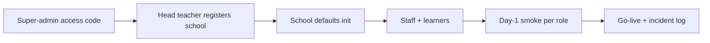

# Pilot school onboarding runbook

Operational guide to bring **one school** live on ZamSchool OS (Week 7).

## Overview



## Phase 0 — Environment (platform team)

1. Deploy staging/production with secrets from `.env.example` (no keys in git).
2. Run automated preflight:
   ```bash
   npm run pilot:preflight
   ```
3. Confirm [PILOT_READINESS_CHECKLIST.md](./PILOT_READINESS_CHECKLIST.md) platform rows (tests, audit, CDN, load test).

## Phase 1 — Access code (super-admin)

1. Sign in as **SUPER_ADMIN** → `/app/super-admin`.
2. Generate a **6-digit school access code** (single use or time-bound per policy).
3. Record code in [SCHOOL_PROFILE.md](./SCHOOL_PROFILE.md) (copy from template).

## Phase 2 — School registration (head teacher)

1. Open `/register` → enter access code → verify via `/api/auth/verify-access-code`.
2. Complete school profile (name, code, head teacher name, address).
3. `POST /api/auth/register-school` links auth user + creates `schools` row.
4. Confirm `initializeSchoolDefaults` output (departments, permission groups, settings).

## Phase 3 — Academic structure (admin)

| Task | UI path | API |
|------|---------|-----|
| Academic year | Admin → settings / years | `/api/admin/academic-years` |
| Terms | Admin → terms | `/api/admin/terms` |
| Classes | Admin → classes | `/api/admin/classes` |
| Subjects | Admin → subjects | `/api/admin/subjects` |
| Timetable | Admin → timetable | `/api/admin/timetable` |

## Phase 4 — People (admin / HR)

1. **Teachers** — Admin → Users → create with temporary password (first-login flow).
2. Assign subject specializations and class assignments.
3. **Students** — enrollment + class + gender for dashboard splits.
4. **Parents** — create accounts; link via Admin → relationships API.
5. **Bursar / payments** — if in scope, create `payments` role user.

## Phase 5 — Day-1 smoke (30–45 min)

Run with pilot school ICT contact present:

| # | Check | Expected |
|---|-------|----------|
| 1 | Head teacher first login + password change | `/first-login` → workspace |
| 2 | Teacher login | `/teacher` bootstrap < 2.5s p95 |
| 3 | Post announcement | Students/parents see in portal |
| 4 | Mark attendance (one class) | Parent/student views update |
| 5 | Avatar upload | CDN URL or proxy; image renders |
| 6 | Fee record (if enabled) | Bursar sees billing summary |

Log any defect in [INCIDENT_LOG.md](./INCIDENT_LOG.md):

```bash
npm run pilot:log-incident -- --severity P2 --summary "Teacher bootstrap slow on 3G" --school "Pilot School"
```

## Phase 6 — Go-live

1. Complete [PILOT_READINESS_CHECKLIST.md](./PILOT_READINESS_CHECKLIST.md).
2. Hand off support contacts and escalation (P1 = outage, P2 = major feature broken, P3 = minor).
3. Review incidents daily during first **two weeks**; weekly after.

## Rollback

| Trigger | Action |
|---------|--------|
| Data corruption | Stop writes; restore Supabase backup; notify school |
| Auth outage | Check Supabase status; verify `getUser()` middleware |
| Tenant leak suspected | Freeze school_id; run `npm run audit:tenant:strict` |

## References

- [PRODUCTION_READINESS_PROGRAM.md](../PRODUCTION_READINESS_PROGRAM.md)
- [CDN_AND_R2.md](../CDN_AND_R2.md)
- [LOAD_TEST_PLAN.md](../LOAD_TEST_PLAN.md)
- [SUPABASE_SECURITY.md](../SUPABASE_SECURITY.md)